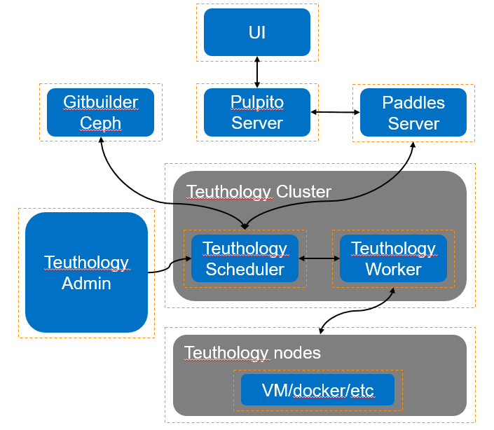
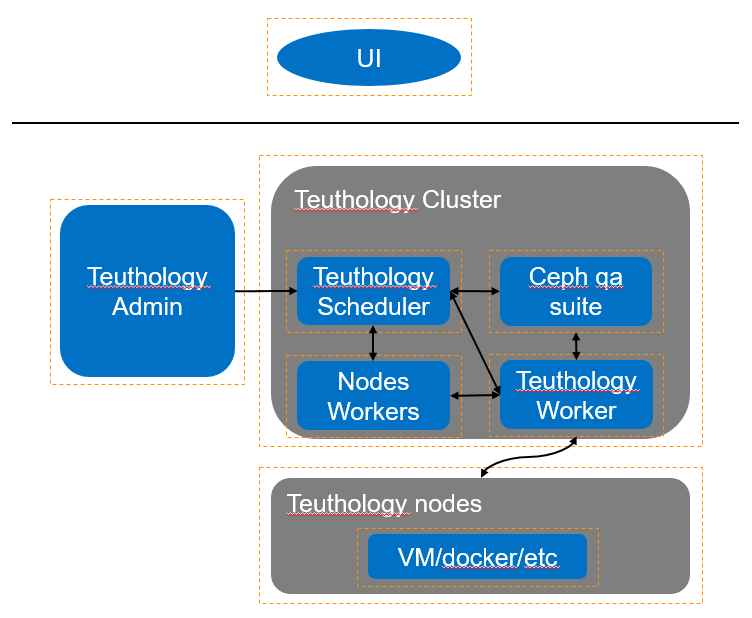

# Teuthology Other Detail Setup Notes

## Introduction

When we setup a Teuthology cluster for Ceph testing. We meet some questions on it. We want to document the setup process and detail method for community to benefit from it.

## Architecture

Teuthology Setup Integration:

Teuthology Cluster Detail:

## Gitbuilder For Ceph Binary

You need get [Gitbuilder](https://github.com/ceph/gitbuilder/blob/master/README). Then you need change those file for yours.
    
    autobuilder.sh
    branches.sh
    branches-local

For Ceph binary build, you also need change Ceph make-debs.sh for your build version. You can use example [here](https://gist.github.com/Ericyuanhui).

## Paddles/Pulpito

You can follow up LAB_SETUP [paddles/pulpito](./LAB_SETUP.rst)

## Teuthology 

### Beanstalkd and other packages

You should install [Beanstalkd](https://github.com/kr/beanstalkd) and configure it on Teuthology yaml file.

    queue_host: localhost
    queue_port: 11300
    
Keep beanstalkd service running.
Install Other packages:
    
    sudo apt-get -y install git python-dev python-pip python-virtualenv libevent-dev python-libvirt beanstalkd

### Teuthology 

As "ubuntu" user. 
Install [Teuthology](https://github.com/ceph/teuthology): 

    ./bootstrap

For Teuthology scheduler and worker. You can follow up LAB_SETUP [scheduler/worker](./LAB_SETUP.rst)

For Teuthology cluster. If you want to use your Ceph repo. You should change config file on teuthology/config.py

    class TeuthologyConfig(YamlConfig):
      def get_ceph_git_url(self):
      
For Teuthology cluster. If you want to use your teuthology repo instead of remote. You should change worker file on teuthology/worker.py

    def prep_job(job_config, log_file_path, archive_dir):
      teuth_path = xxx
      
After finish all configuration. You can run [Teuthology-suite](./README.rst) 
 
